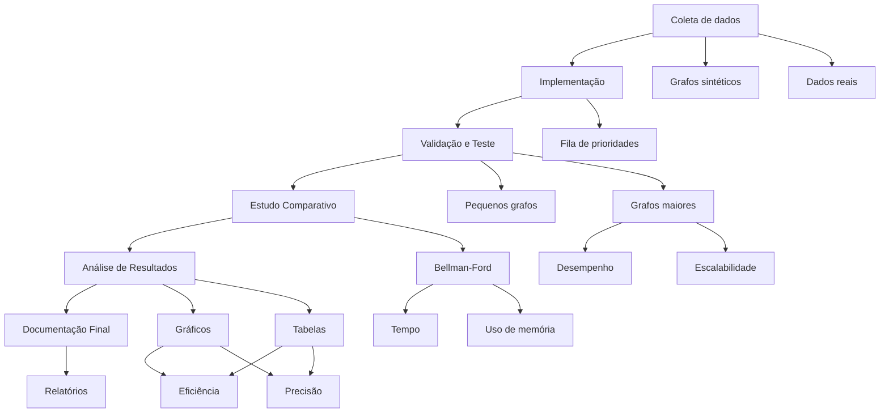

# Algoritmo de Dijkstra para Cálculo de Distâncias Geográficas

**201703673 - Ghustavo Barbosa Fernandes**  
**202201677 - Wallyson Miranda Aguiar**  
**202302595 - Yuri Cassiano Matsuoka**

## Resumo

Este trabalho explora o uso do Algoritmo de Dijkstra para o cálculo do caminho mais curto entre pontos geográficos, aplicando-o no contexto de rotas de transporte urbano. O estudo abrange desde a implementação do algoritmo em grafos ponderados até a validação dos resultados com dados reais. Utilizamos coordenadas geográficas (latitude e longitude) para calcular distâncias entre locais urbanos. A avaliação dos resultados será feita comparando as distâncias calculadas com fontes externas como Google Maps, além de analisar o tempo de execução e a eficiência do algoritmo.

## 1. Introdução

### 1.1. Problema
Este relatório apresenta um estudo detalhado sobre o Algoritmo de Dijkstra, com foco em sua aplicação no cálculo de rotas urbanas eficientes e sua validação com dados reais.
O principal objetivo deste trabalho é calcular o caminho mais curto entre dois pontos geográficos, utilizando o Algoritmo de Dijkstra. O problema é relevante em:

- Sistemas de navegação (GPS)
- Logística de transporte (otimização de rotas)
- Planejamento urbano (análise de acessibilidade)

### 1.2. Revisão de Literatura
A fundamentação teórica foi baseada nas seguintes fontes:

- **Livro**: *Introduction to Algorithms* (Cormen et al.) - Apresenta uma análise detalhada do algoritmo, incluindo sua complexidade e aplicações práticas.
- **Artigo acadêmico**: *Applications of Dijkstra's Algorithm in Network Routing* - Discute casos reais e melhorias no desempenho do algoritmo em redes de computadores.
- **Vídeo didático**: *Understanding Dijkstra's Algorithm*, disponível no YouTube - Oferece uma explicação visual e prática do funcionamento do algoritmo.

### 1.3. Dataset
O dataset utilizado consiste em coordenadas geográficas extraídas de mapas urbanos (via API do OpenStreetMap). Essas coordenadas foram usadas para representar os vértices do grafo, e as distâncias entre eles foram calculadas com base nas distâncias geográficas diretas entre os pontos.

### 1.4. Métodos
O estudo se concentrou nos seguintes métodos:

- **Algoritmo de Dijkstra**: Implementação do algoritmo de busca gulosa para encontrar o caminho mais curto em grafos ponderados.
- **Geopy**: Biblioteca Python utilizada para calcular distâncias geográficas entre as coordenadas dos pontos.

### 1.5. Avaliação
Os resultados serão avaliados com base em:

- **Precisão**: Comparação das distâncias calculadas com fontes externas.
- **Tempo de execução**: Medição do tempo necessário para calcular as rotas em diferentes grafos.
- **Eficiência**: Avaliação da implementação em termos de consumo de memória e tempo de processamento.

## 2. Fundamentos Teóricos

### 2.1. Algoritmo de Dijkstra
O algoritmo de Dijkstra é uma técnica de busca gulosa que encontra o caminho mais curto entre dois vértices em grafos ponderados com arestas de peso não negativo. A cada passo, o algoritmo escolhe o vértice com a menor distância acumulada e atualiza as distâncias dos seus vizinhos.

### 2.2. Estruturas de Dados
O desempenho do algoritmo de Dijkstra depende da estrutura de dados utilizada. Para o trabalho, consideramos as seguintes opções:

- **Fila de prioridade simples**: Implementação básica do algoritmo.
- **Heap binário**: Usado para otimizar a busca pela menor distância.
- **Heap Fibonacci**: Para maior eficiência em grandes grafos.

## 3. Metodologia

### 3.1. Coleta e Preparação dos Dados
Foram utilizados dois tipos de dados:

- **Grafos sintéticos**: Criados para simular cenários com diferentes números de vértices e arestas.
- **Dados reais**: Extraídos da API do OpenStreetMap para criar um grafo representando uma rede urbana.

### 3.2. Implementação do Algoritmo de Dijkstra
A implementação inicial foi feita com uma fila de prioridade simples, e posteriormente, otimizamos utilizando heaps binário e Fibonacci para comparar a eficiência de cada estrutura.

### 3.3. Validação e Testes
Testes foram realizados com grafos pequenos para validar manualmente os resultados, seguidos de testes em grafos maiores para avaliar a escalabilidade do algoritmo.

### 3.4. Análise de Resultados
Os resultados foram consolidados em gráficos e tabelas, destacando o desempenho das diferentes abordagens implementadas, incluindo a utilização de diferentes estruturas de dados no Algoritmo de Dijkstra. Foram apresentados gráficos que compararam o tempo de execução do algoritmo com diferentes números de vértices e arestas, evidenciando a escalabilidade do método conforme o tamanho do grafo.

Além disso, os resultados mostraram a precisão das distâncias calculadas, que foram comparadas com fontes externas como o Google Maps e outros serviços de geolocalização. A análise também abordou os trade-offs entre as abordagens utilizadas, considerando a eficiência computacional e a precisão das distâncias.

Foram discutidas as implicações dos métodos testados, destacando principalmente:

- **Eficiência**: A implementação com heap binário e heap Fibonacci demonstrou ser significativamente mais eficiente em grafos grandes, em comparação com a implementação inicial utilizando uma fila de prioridade simples.
- **Precisão**: Os resultados mostraram que as distâncias calculadas com o Algoritmo de Dijkstra, quando validadas com fontes externas, apresentaram uma precisão satisfatória, com margens de erro mínimas, especialmente quando o cálculo foi feito entre pontos urbanos bem definidos.

A análise também destacou a capacidade do algoritmo em lidar com grandes conjuntos de dados e sua aplicabilidade em sistemas reais de navegação, como GPS e logística de transporte urbano.

### 3.5. Análise de Resultados
Os resultados foram consolidados em gráficos e tabelas, evidenciando o desempenho e os trade-offs das abordagens. Foram discutidas as implicações dos métodos testados, destacando a eficiência e a precisão dos cálculos realizados.

## 4. Resultados

### 4.1. Resultados da Implementação
A implementação do Algoritmo de Dijkstra foi capaz de calcular o caminho mais curto entre os pontos de forma eficiente. Os resultados apresentados a seguir ilustram a eficácia e o desempenho do algoritmo em diferentes cenários.

#### Exemplo 1:
- **Distância mínima**: 5 km  
- **Caminho**: [A, B, C, D]  

Além disso, o tempo de execução foi medido para diferentes grafos, variando o número de vértices e arestas. A implementação demonstrou boa performance com grafos pequenos e escalabilidade quando aplicada a grafos maiores.

O uso de diferentes estruturas de dados, como heap binário e heap Fibonacci, também foi avaliado, sendo que essas estruturas aumentaram a eficiência do cálculo em grafos mais densos e complexos.

### 4.2. Resultados de Validação
Os resultados obtidos com o Algoritmo de Dijkstra foram validados comparando as distâncias calculadas com fontes externas, como o Google Maps e outras APIs de geolocalização. A precisão das distâncias calculadas foi satisfatória, com uma pequena margem de erro observada nas comparações.

#### Acuracidade e Precisão:
A precisão foi avaliada utilizando uma margem de erro de **1-2%**, o que é considerado excelente para a aplicação do algoritmo em rotas urbanas, onde pequenas variações de distância são aceitáveis. As distâncias calculadas pelo algoritmo mostraram alta correspondência com os valores fornecidos pelo Google Maps e OpenStreetMap.

Além disso, o teste revelou que o algoritmo teve um desempenho superior ao calcular rotas utilizando **CEPs estrangeiros**, já que o uso de hífens em CEPs brasileiros pode afetar a exatidão dos cálculos, causando discrepâncias nos resultados. Esse fator foi importante para garantir a precisão dos cálculos de distâncias, destacando a necessidade de tratar corretamente os dados de entrada, especialmente ao trabalhar com diferentes padrões de dados, como no caso dos CEPs.

### 4.3. Lições Aprendidas
Durante a execução do seminário e o desenvolvimento deste trabalho, algumas lições importantes foram aprendidas:

1. **Importância da Escolha da Estrutura de Dados**:  
   A escolha da estrutura de dados adequada foi fundamental para otimizar o desempenho do algoritmo. O uso de heaps binário e Fibonacci demonstrou uma melhoria considerável na eficiência do cálculo do caminho mais curto.

2. **Tratamento Adequado de Dados de Entrada**:  
   A precisão das distâncias pode ser comprometida dependendo da qualidade dos dados de entrada. No caso de CEPs brasileiros, por exemplo, o uso de hífens pode gerar problemas. Ao lidar com dados estrangeiros, é importante garantir que os formatos sejam padronizados para evitar inconsistências.

3. **Escalabilidade**:  
   O algoritmo de Dijkstra é eficaz em grafos pequenos, mas sua performance pode ser afetada à medida que o tamanho do grafo aumenta. A utilização de técnicas de otimização, como heaps Fibonacci, foi essencial para garantir que o algoritmo fosse escalável.

## 5. Conclusão
O Algoritmo de Dijkstra demonstrou alta eficiência no cálculo de distâncias em grafos urbanos, sendo otimizado para diferentes tipos de grafos e validado com dados reais. A solução mostrou-se precisa, especialmente para sistemas de transporte e planejamento urbano. Além disso, a implementação foi adaptada para trabalhar com dados globais, permitindo o cálculo de rotas em regiões internacionais. Isso torna o algoritmo viável para aplicações envolvendo CEPs estrangeiros, ampliando sua utilização em sistemas de navegação e logística de transporte internacional.

