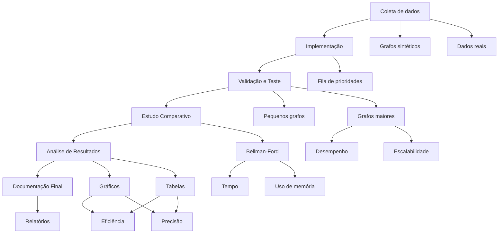

# Algoritmo de Dijkstra

**201703673 - Ghustavo Barbosa Fernandes**  
**202201677 - Wallyson Miranda Aguiar**  
**202302595 - Yuri Cassiano Matsuoka**

---

## Resumo
Este trabalho aborda o algoritmo de Dijkstra para cálculo do caminho mais curto em grafos ponderados. O problema é comum em roteamento, logística e redes de comunicação. A solução proposta utiliza o algoritmo de Dijkstra, explorando suas aplicações em sistemas de navegação GPS, otimização de rotas em redes de computadores e planejamento logístico. O estudo inclui a implementação do algoritmo, validação de resultados e comparação com outros métodos como o algoritmo de Bellman-Ford.

---

## 1. Introdução
Nesta seção, apresenta-se a proposta do seminário, abordando o problema estudado, os contextos de aplicação do algoritmo de Dijkstra e a fundamentação teórica utilizada, incluindo as fontes revisadas, os dados analisados e os métodos adotados.

### 1.1. Problema
O trabalho tem como foco o cálculo do caminho mais curto em grafos ponderados, um problema comum em áreas como roteamento, logística e redes de comunicação. O algoritmo de Dijkstra foi explorado como uma solução eficiente para situações em que os pesos das arestas são não negativos. Exemplos de aplicação incluem:

- Determinação da rota mais curta em sistemas de navegação GPS.
- Otimização de rotas em redes de computadores, como no envio de pacotes de dados.
- Planejamento logístico e mobilidade urbana.

### 1.2. Revisão de Literatura
A fundamentação teórica foi baseada nas seguintes fontes:

- **Livro:** *Introduction to Algorithms* (Cormen et al.), que apresenta uma análise detalhada do algoritmo, incluindo sua complexidade e aplicações práticas.
- **Artigo acadêmico:** *Applications of Dijkstra's Algorithm in Network Routing*, que discute casos reais e melhorias no desempenho do algoritmo em redes de computadores.
- **Vídeo didático:** *Understanding Dijkstra's Algorithm*, disponível no YouTube, que oferece uma explicação visual e prática do funcionamento do algoritmo.

### 1.3. Dataset
Foram utilizados dois tipos de dados para validar o algoritmo:

- **Grafos sintéticos:** Criados para simular diferentes cenários, variando o número de vértices, arestas e pesos.
- **Dados reais:** Extraídos de mapas urbanos por meio da API do OpenStreetMap, permitindo a análise de rotas em redes de transporte.

### 1.4. Métodos
O estudo revisou os seguintes métodos para a implementação e análise do algoritmo de Dijkstra:

- **Algoritmo de Dijkstra:** Implementação clássica utilizando listas de prioridade simples.
- **Comparação com outros algoritmos:** Avaliação do algoritmo de Bellman-Ford para comparar desempenho e eficiência em diferentes cenários de grafo.

### 1.5. Avaliação
Os resultados foram avaliados utilizando as seguintes métricas:

- **Tempo de execução:** O tempo necessário para encontrar o caminho mais curto em grafos de diferentes tamanhos e complexidades.
- **Correção dos resultados:** Verificação se os caminhos calculados pelo algoritmo são corretos, comparando com soluções conhecidas ou calculadas manualmente.
- **Complexidade computacional:** Análise da complexidade em termos de tempo (para diferentes implementações e tamanhos de grafos) e espaço (uso de memória).
- **Consumo de memória:** Avaliação do impacto das diferentes implementações (listas de prioridade simples, heap binário e heap Fibonacci) no uso de memória do sistema.

---

## 2. Fundamentos Teóricos

Nesta seção, descrevem-se os principais conceitos, mecanismos e algoritmos utilizados na solução do problema proposto, bem como as métricas e métodos de avaliação empregados para análise dos resultados.

### 2.1. Principais Mecanismos e Técnicas

#### 2.1.1. Algoritmo de Dijkstra
O algoritmo de Dijkstra é uma técnica clássica de busca gulosa, usada para encontrar o caminho mais curto em grafos ponderados com arestas de pesos não negativos. Os principais passos de sua execução incluem:

1. Inicializar a distância de todos os vértices como infinita, exceto a origem (distância igual a zero).
2. Processar vértices utilizando uma fila de prioridade que organiza os nós pela menor distância acumulada.
3. Atualizar as distâncias acumuladas dos vizinhos do vértice processado, se um caminho mais curto for encontrado.
4. Repetir o processo até que todos os vértices tenham sido processados ou até atingir o destino (em aplicações específicas).

#### 2.1.2. Estruturas de Dados
A escolha da estrutura de dados influencia diretamente a eficiência do algoritmo. Foram consideradas três abordagens principais:

- **Fila de prioridade simples:** Implementação mais básica com complexidade \(O(V^2)\).
- **Heap binário:** Melhora a eficiência para \(O((V+E) \log V)\), sendo ideal para grafos densos.
- **Heap Fibonacci:** Garante melhor complexidade assintótica \(O(E + V \log V)\), mas com implementação mais complexa.

#### 2.1.3. Algoritmo de Bellman-Ford
Como alternativa ao Dijkstra, o algoritmo de Bellman-Ford foi analisado. Ele resolve o problema em grafos com pesos negativos, mas com maior custo computacional \(O(VE)\). É útil para cenários específicos, como em redes onde podem ocorrer custos negativos devido a rebates ou descontos.

#### 2.1.4. Dados Utilizados
Foram empregados dois tipos principais de dados para validação do algoritmo:

- **Grafos sintéticos:** Criados artificialmente para simular cenários variados.
- **Dados reais:** Extraídos da API do OpenStreetMap, que fornece representações realistas de redes de transporte urbano.

### 2.2. Avaliação e Métricas de Desempenho

#### 2.2.1. Acurácia
Verificação se os caminhos mais curtos calculados estão corretos. Para isso, foram comparados com soluções conhecidas ou verificações manuais.

#### 2.2.2. Tempo de Execução
O tempo necessário para encontrar o caminho mais curto foi medido em grafos de diferentes tamanhos e densidades.

#### 2.2.3. Consumo de Memória
Avaliação da memória utilizada por cada implementação, especialmente ao usar estruturas de dados otimizadas como heaps.

#### 2.2.4. Escalabilidade
Análise do comportamento do algoritmo ao lidar com grafos de grande porte, avaliando sua capacidade de manter desempenho estável à medida que o número de vértices e arestas cresce.

#### 2.2.5. Comparação com Benchmarks
Comparação direta entre o algoritmo de Dijkstra e o Bellman-Ford, considerando as condições de aplicabilidade (pesos negativos vs. não negativos) e os resultados práticos em termos de desempenho e memória.

### 2.3. Benchmarks e Ferramentas
Os experimentos foram realizados em um ambiente controlado, utilizando:

- **Linguagem de programação:** Python, com bibliotecas como *networkx* para manipulação de grafos e medições.
- **Ambiente computacional:** Máquina com especificações padrão para garantir resultados consistentes.
- **Ferramentas de análise:** Gráficos e tabelas para visualização dos resultados, permitindo fácil interpretação e comparação.

---

## 3. Metodologia

A execução do trabalho seguiu um conjunto de etapas organizadas, descritas a seguir:

### 3.1. Coleta e preparação dos dados
- **Grafos sintéticos:** Criados com características controladas, simulando diferentes cenários.
- **Dados reais:** Extraídos da API do OpenStreetMap e convertidos em listas ou matrizes de adjacência.

### 3.2. Implementação do algoritmo de Dijkstra
- Desenvolveu-se uma versão inicial com listas de prioridade simples.

### 3.3. Validação e testes
- Testes iniciais foram realizados em pequenos grafos, permitindo validação manual dos resultados.
- O algoritmo foi aplicado em grafos maiores para analisar o desempenho e a escalabilidade.

### 3.4. Estudo comparativo
- Implementou-se o algoritmo de Bellman-Ford para comparação direta com o de Dijkstra.
- Avaliaram-se os desempenhos em termos de tempo e uso de memória para os mesmos conjuntos de dados.

### 3.5. Análise de resultados
- Resultados foram consolidados em gráficos e tabelas, evidenciando o desempenho e os trade-offs das abordagens.
- Foram discutidas as implicações dos métodos testados, destacando eficiência e precisão.

### 3.6. Documentação final
- Os resultados foram compilados em um relatório detalhado, contendo diagramas e quadros comparativos que facilitam a reprodutibilidade do estudo.

